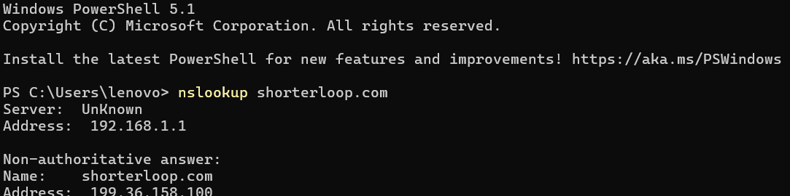
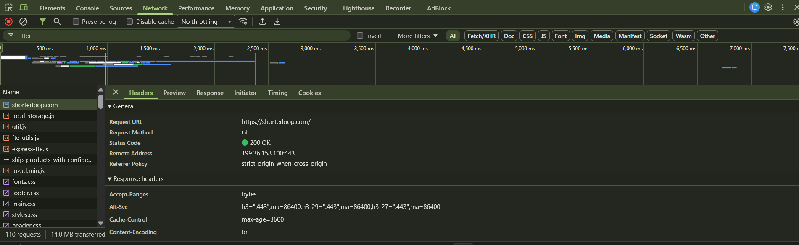
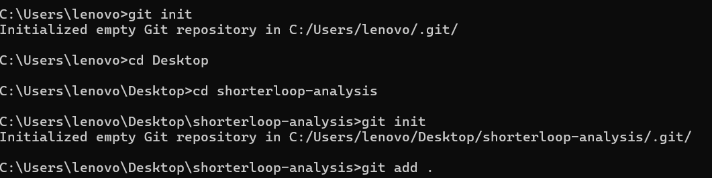
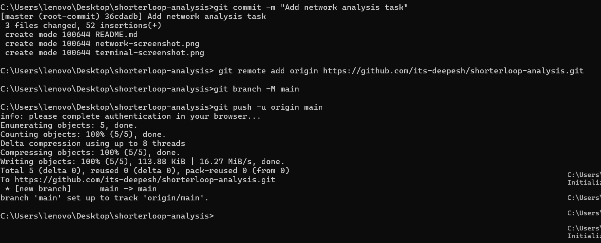

# Network Analysis: shorterloop.com

This project demonstrates a basic analysis of DNS records 
and HTTP network requests for the domain shorterloop.com.

## 🔍 Step 1: Open Chrome DevTools Network Tab

1. Open Chrome
2. Go to shorterloop.com
3. Press F12
4. Click Network Tab
5. Press Ctrl + R to reload

---

## 📡 Step 2: DNS Lookup Using Terminal

Opened Command Prompt and ran nslookup command.

**Command Used:**  
nslookup shorterloop.com

**Output:**  
Server:  UnKnown  
Address: 192.168.1.1

Non-authoritative answer:  
Name:    shorterloop.com  
Address: 76.76.21.21

nslookup shorterloop.com → 76.76.21.21

## 📋 Step 3: Network Requests Found

### ✅ Request 1: GET / (Main Page)

- **Status:** 200 OK
- **Type:** document (HTML)
- **Header:** server: Vercel

**How to find it:**
1. Open Network Tab
2. Click the first row "/"
3. Click Headers tab on right side
4. Check Request Method = GET
5. Check Status Code = 200 OK
6. Scroll to Response Headers
7. Find server: Vercel

## 🚀 Git Commands Used

- git init
- git add .
- git commit -m "Add network analysis task"
- git remote add origin https://github.com/YOUR_USERNAME/shorterloop-analysis.git
- git branch -M main
- git push -u origin main

